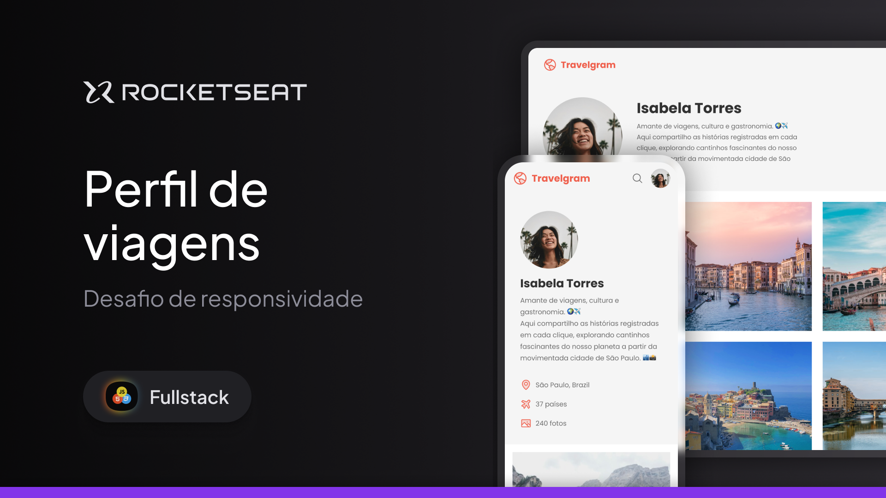

# 🌍📱 Travelgram

Travelgram é uma rede social fictícia de viagens, desenvolvida como **desafio de responsividade** durante o curso da **Rocketseat** com o professor **Mayk Brito**. O principal objetivo deste projeto foi praticar a construção de interfaces com **HTML**, **CSS** e o uso de **técnicas de design responsivo**.

---

## 🧠 Proposta do projeto

A proposta foi criar uma interface de perfil de uma rede social voltada para viagens, com foco em:

- Estruturação semântica com HTML5  
- Estilização com CSS3 moderno  
- Aplicação de técnicas de **responsividade (mobile-first)**  
- Prática de **Flexbox** e **Grid Layout**  
- Layout adaptável a diferentes tamanhos de tela

---

## 🛠️ Tecnologias utilizadas

- **HTML5**
- **CSS3**